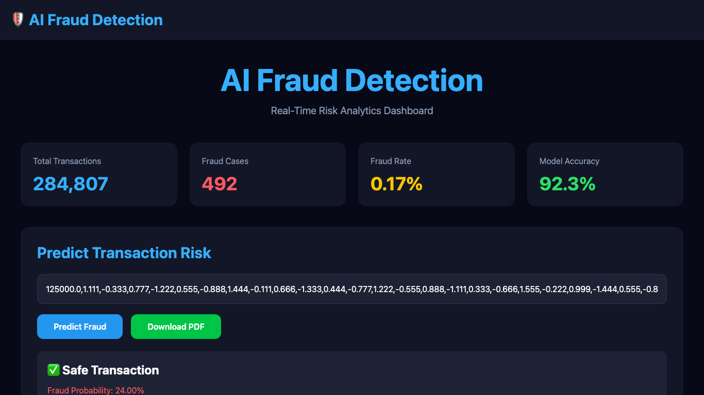
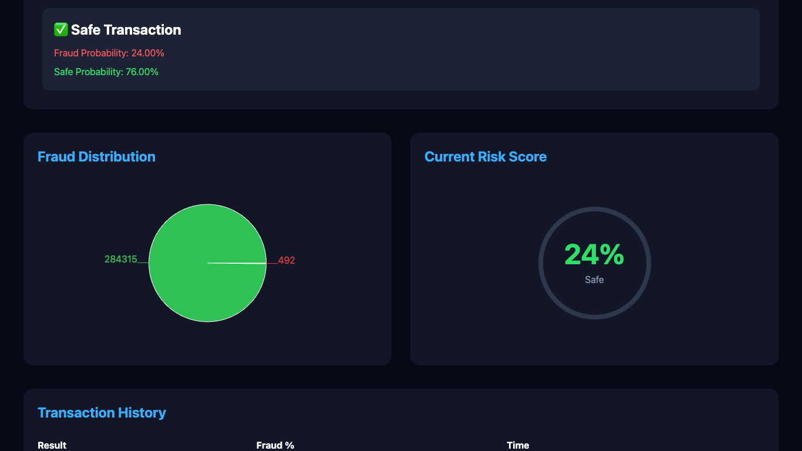
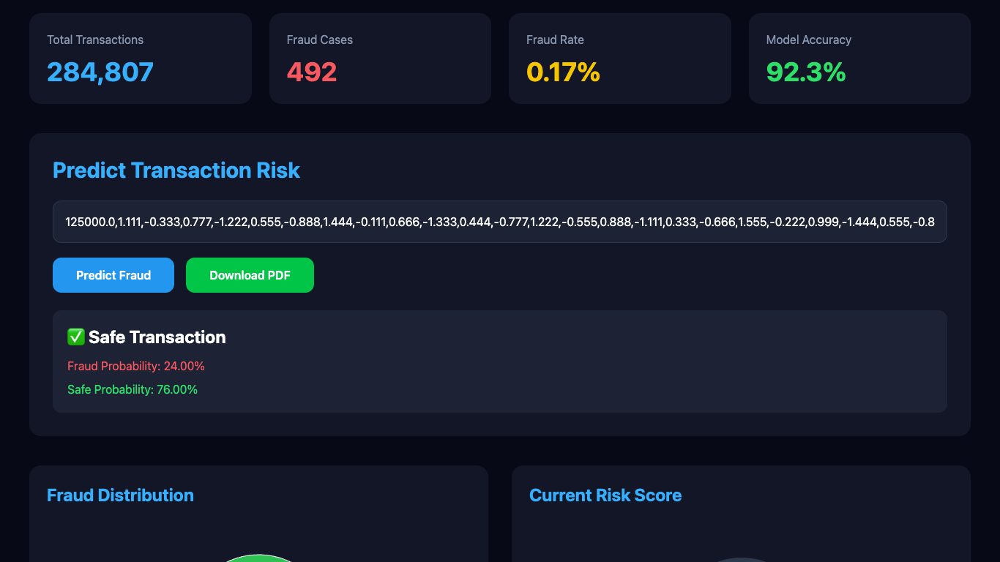
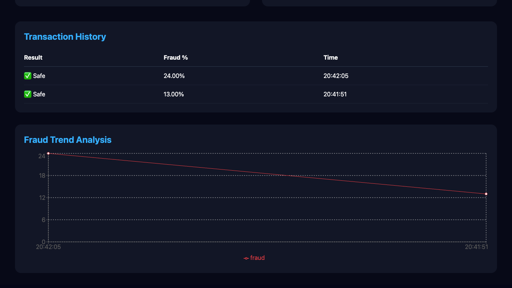

# 🛡️ AI Fraud Detection & Risk Analytics System

An end-to-end Machine Learning based Fraud Detection System that predicts fraudulent financial transactions in real-time using a Random Forest Classifier and provides an interactive analytics dashboard built with React.js and FastAPI.

---

  

Machine Learning Based Real-Time Fraud Detection Platform

## 🚀 Live Demo

### Frontend

https://ai-fraud-system.vercel.app/

### Backend API

https://ai-fraud-system-exn5.onrender.com

---

## 📌 Features

✅ Real-Time Fraud Prediction

✅ Random Forest Machine Learning Model

✅ FastAPI REST API

✅ React.js Dashboard

✅ Fraud Probability Scoring

✅ Interactive Pie Chart Analytics

✅ Fraud Trend Visualization

✅ Transaction History Tracking

✅ PDF Report Generation

✅ Responsive Modern UI

---

## 🛠️ Tech Stack

### Frontend

* React.js
* Tailwind CSS
* Axios
* Recharts
* jsPDF

### Backend

* FastAPI
* Python
* NumPy
* Joblib

### Machine Learning

* Scikit-Learn
* Random Forest Classifier

### Deployment

* Vercel
* Render

---

## 📊 Dataset

Credit Card Fraud Detection Dataset

Total Transactions: 284,807

Fraud Transactions: 492

Fraud Rate: 0.17%

---

## 🏗️ System Architecture

User Input

↓

React Dashboard

↓

Axios API Request

↓

FastAPI Backend

↓

Random Forest Model

↓

Prediction Response

↓

Dashboard Analytics & PDF Report

---

## 📸 Screenshots

### Dashboard Home

### Fraud Prediction

### Risk Analytics

### Transaction History

---

## 📈 Model Performance

Accuracy: 92%+

Fraud Probability Prediction

Safe Transaction Prediction

Real-Time Risk Scoring

---

## 👨‍💻 Author

Pawan Jogi

GitHub:
https://github.com/PawanJogi07

LinkedIn:

](https://www.linkedin.com/in/pawan-jogi-716992338/)

---

